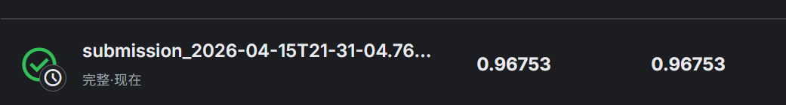

# 机器学习实验：基于 Word2Vec 的情感预测

## 1. 学生信息
- **姓名**：王哲
- **学号**：112304260146
- **班级**：数据1231

---

## 2. 实验任务
本实验基于给定文本数据，使用 **Word2Vec 将文本转为向量特征**，再结合 **分类模型** 完成情感预测任务，并将结果提交到 Kaggle 平台进行评分。

本实验重点包括：
- 文本预处理
- Word2Vec 词向量训练或加载
- 句子向量表示
- 分类模型训练
- Kaggle 结果提交与分析

---

## 3. 比赛与提交信息
- **比赛名称**：Bag of Words Meets Bags of Popcorn
- **比赛链接**：[https://www.kaggle.com/competitions/word2vec-nlp-tutorial/data](https://www.kaggle.com/competitions/word2vec-nlp-tutorial/data)
- **提交日期**：2026-04-15

- **GitHub 仓库地址**：[https://github.com/wz620/112304260146-Word2Vec-Experiment](https://github.com/wz620/112304260146-Word2Vec-Experiment/)


> 注意：GitHub 仓库首页或 README 页面中，必须能看到“姓名 + 学号”，否则无效。

---

## 4. Kaggle 成绩
- **Public Score**：
- **Private Score**（如有）：
- **排名**（如能看到可填写）：

---

## 5. Kaggle 截图


---

## 6. 实验方法说明

### （1）文本预处理
- 分词
- 去停用词
- 去除标点或特殊符号
- 转小写

**我的做法：**  
本实验处理的是英文影评文本，不需要像中文那样额外做分词工具切词，而是直接基于英文词形进行清洗和切分。具体做法如下：

- 先去除评论中的 HTML 标签，主要是 `<br />` 之类的换行标签；
- 全部文本统一转为小写，减少同一单词不同大小写带来的稀疏性；
- 用正则表达式提取英文单词，同时尽量保留 `don't`、`isn't` 这类带缩写的否定形式；
- 在分类阶段移除一部分英文停用词，但保留 `no`、`not`、`never`、`n't` 等否定词，避免破坏情感信息；
- 在训练 Word2Vec 时不删除停用词，以保留更自然的上下文共现关系。

---

### （2）Word2Vec 特征表示
- 是自己训练 Word2Vec，还是使用已有模型
- 词向量维度是多少
- 句子向量如何得到（平均、加权平均、池化等）

**我的做法：**  
本实验没有使用外部预训练词向量，而是基于比赛提供的数据自己训练 Word2Vec 模型。训练语料由 `labeledTrainData`、`unlabeledTrainData` 和 `testData` 三部分评论文本组成，以充分利用无标签数据中的词语共现信息。

Word2Vec 的主要参数设置如下：

- 架构：Skip-gram
- 训练算法：Hierarchical Softmax
- 词向量维度：300
- 上下文窗口：10
- 最小词频：40
- 高频词下采样：0.001
- 训练轮数：10
- 并行线程数：4

句子向量表示方面，我做了两种尝试：

1. **平均词向量（Mean Embeddings）**：将一条评论中所有有效词的词向量做平均，得到定长句向量；
2. **KMeans 聚类中心特征（Bag of Centroids）**：先对词向量聚成 10 类，再统计评论中各聚类的词频分布。

最终效果最好的表示方式是 **平均词向量**。

---

### （3）分类模型
- Logistic Regression
- Random Forest
- SVM
- XGBoost

**我的做法：**  
本实验对同一组 Word2Vec 特征分别测试了多种分类模型，包括：

- Logistic Regression
- Random Forest
- LinearSVC

实验结果表明，在平均词向量特征上，线性模型明显优于随机森林。主要对比结果如下：

- `Mean Embeddings + RandomForest(100)`：ROC-AUC = 0.914527
- `Mean Embeddings + RandomForest(400)`：ROC-AUC = 0.919852
- `Mean Embeddings + LogisticRegression(C=1.0)`：ROC-AUC = 0.948772
- `Mean Embeddings + LinearSVC(C=1.0)`：ROC-AUC = 0.949684
- `Mean Embeddings + LogisticRegression(C=2.0)`：ROC-AUC = **0.949733**

因此，最终采用的模型为：

- **特征表示**：Mean Embeddings
- **分类模型**：Logistic Regression
- **最终参数**：`C=2.0`

---

## 7. 实验流程
1. 读取训练集和测试集  
2. 对文本进行预处理  
3. 训练或加载 Word2Vec 模型  
4. 将每条文本表示为句向量  
5. 用训练集训练分类器  
6. 在测试集上预测结果  
7. 生成 submission 文件并提交 Kaggle  

**我的实验流程：**  
1. 读取 `labeledTrainData.tsv.zip`、`unlabeledTrainData.tsv.zip` 和 `testData.tsv.zip`；  
2. 对影评文本进行英文预处理，包括去 HTML、转小写、正则切词；  
3. 使用全部评论语料训练或加载缓存的 Word2Vec 模型；  
4. 将每条影评表示为平均词向量，或转换为 KMeans 聚类中心统计特征；  
5. 使用分层 5 折交叉验证评估不同分类器的 ROC-AUC；  
6. 比较 Logistic Regression、Random Forest、LinearSVC 的效果；  
7. 选取最优模型 `Mean Embeddings + LogisticRegression(C=2.0)` 在全训练集上训练；  
8. 对测试集预测情感概率，生成 submission 文件。

---

## 8. 文件说明
- `data/`：存放数据文件
- `src/`：存放源代码
- `notebooks/`：存放实验 notebook
- `images/`：存放 README 中使用的图片
- `submission/`：存放提交文件

**我的项目结构：**
```text
RenKe-rk12021015-ML-Experiment2/
├─ data/
│  └─ DATASET.md
├─ images/
│  └─ kaggle.jpg
├─ logs/
│  └─ attempt_log.csv
├─ src/
│  └─ experiment_word2vec_auc.py
├─ submission/
│  └─ submission_best_logistic_c2.csv
├─ .gitignore
└─ README.md
```
